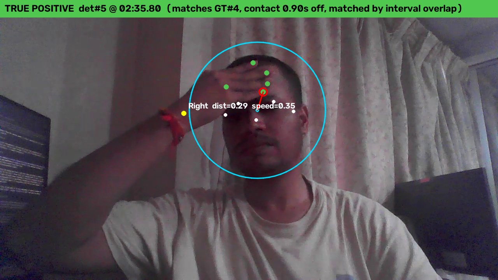

# How the head-touch detector works

The system takes a video and returns timestamps of hand-to-head touches. It is a
rule-based detector built on top of pretrained landmark models; nothing in it is trained
on this project's data. Each frame goes through four stages, and the per-frame results
are then turned into discrete events.

```
video frame ──► 1. landmarks ──► 2. geometry ──► 3. speed gate ──► 4. event state machine ──► events CSV
              (MediaPipe pose      (head circle,    (wrist speed,      (debounce, start /        (start, contact,
               + hand models)       normalized       head-widths/sec)   contact / end)             end, hand)
                                    distance)
```

## 1. Landmarks (pretrained)

MediaPipe's **Pose Landmarker** provides the head points (nose, eyes, ears). Its
**Hand Landmarker** provides 21 points per hand plus a left/right label. Both are generic
models published by Google and used as-is, through the MediaPipe Tasks API in `VIDEO`
mode (which uses tracking between frames).

Pose landmarks are used for the head rather than Face Mesh because the moment of contact
is when the face is partly occluded by the hand, and face tracking is expected to degrade
under occlusion. **This is a reasoned choice; the two were not compared on this video.**

## 2. Geometry: the head as a circle

- **Centre:** the average of the visible head points (nose, eyes, ears; each must have
  visibility >= 0.5, and at least two must be visible).
- **Radius (`head_scale`):** the ear-to-ear distance. If the ears are not both visible,
  it falls back to 2.6 x the eye-to-eye distance, then to 0.55 x the shoulder width.
- **Distance:** for each detected hand, take the closest of six landmarks (the wrist and
  the five fingertips) to the head centre, and divide by `head_scale`. A value of 1.0 is
  exactly the edge of the circle; below 1.0 means that landmark is inside it.
- Dividing by head size makes the value comparable whether the person is near or far from
  the camera.

## 3. Speed gate

A frame counts as "touching" only if the hand is inside the circle **and** slow. A real
touch stops the hand; a gesture passes through the circle quickly.

- Speed is the **wrist's** pixel speed, divided by `head_scale`, so it is in
  **head-widths per second**, smoothed over 3 frames.
- The wrist is used rather than the closest fingertip because the "closest" landmark can
  switch fingers from frame to frame and would fake motion on a hand that is still.
- If the hand was not detected for more than 0.25 s, speed is treated as unknown (not
  slow).
- Threshold: 0.5 head-widths/sec.

## 4. Event state machine

Turns the per-frame flags into events, per hand label:

- **Start:** 3 consecutive detected frames that pass the gate. The reported start time is
  back-dated to the first of those frames.
- **End:** 10 consecutive frames that fail the gate.
- **Detection dropouts:** frames where the hand is not detected do not count toward the
  end, so a hand that is briefly hidden by the head or its own occlusion mid-touch keeps
  the touch open.
- **Contact time:** the frame with the smallest distance within 1.5 s of the start. The
  window is bounded because a hand lingering near the head can keep one event open for
  many seconds, and an unbounded minimum could pick an unrelated later dip. Note that this
  frame is chosen by distance only; the hand can still be moving at that frame.

## Worked example

Ground-truth touch #3 is annotated with contact at **02:27.93**. The detector reports
start **02:27.63** and contact **02:27.90**, with a minimum normalized distance of **0.571**
(an index fingertip well inside the circle). Timing error: **0.03 s**.


The drawing shows the head circle (cyan; its edge is distance 1.0), the head keypoints
(white), the wrist (yellow) and fingertips (green) of each hand, and the closest hand
landmark joined to the head centre (red).

## Evaluation and tuning

- **`evaluate.py`** matches detected events to annotated events one-to-one by nearest
  `contact_time` within +/-0.5 s, and reports precision, recall, F1 and timing error. The
  hand label is reported but does not decide a match. `--match-mode overlap` additionally
  accepts a detection whose `[start, end]` interval overlaps the annotated one.
- **`tune_threshold.py`** grid-searches four settings (distance threshold, speed threshold,
  enter frames, exit frames) against the annotations, using the cached per-frame signal so
  the slow landmark pass is never repeated.

Result on the recording, 5 annotated touches. The original annotation had 3 and the
settings were tuned on those; a 4th and a 5th were added after the detector's output had
been seen (see the README):

| Matching rule | Config | Found | Extra detections | Precision | Recall |
|---|---|---|---|---|---|
| Strict (contact within +/-0.5 s), headline | Speed gate (current) | 3 of 5 | 8 | 0.27 | 0.60 |
| Overlap (also accepts overlapping intervals; added afterwards) | Speed gate (current) | 4 of 5 | 7 | 0.36 | 0.80 |
| Strict | Distance only | 4 of 5 | 20 | 0.17 | 0.80 |
| Overlap | Distance only | 5 of 5 | 19 | 0.21 | 1.00 |

Two touches are not counted by the strict rule with the speed gate:
- The 4th (forehead) is detected, but its detected contact time (the closest frame) is
  0.90 s after the annotated landing, so only the overlap rule counts it.
- The 5th (a quick touch at 03:18) is not detected at all. Its wrist speed while close to
  the head is 0.74-3.55 head-widths/sec (mostly 0.7-1.5), always above the 0.5 threshold,
  so the gate rejects it; the distance-only version finds it.

So the speed gate is a trade-off: it cuts extra detections from 20 to 8 but lowers recall
from 0.80 to 0.60 (strict).

The missed 5th touch, at the annotated contact time. The hand is on the head and inside
the circle (distance 0.89), but no detection fires because the hand is still moving:


## Files

| File | Role |
|---|---|
| `src/inspect_video.py`, `src/annotate.py` | Video metadata; interactive ground-truth annotation tool |
| `src/head_touch_detector.py` | The core: landmarks, distance, speed, event extraction |
| `src/evaluate.py`, `src/tune_threshold.py` | Scoring and parameter search |
| `src/visualize_events.py` | Draws the detector's view on each detected contact frame |
| `src/timeutils.py`, `src/download_models.py` | Shared time helpers; model download |

## What the false positives look like

All 8 extra detections under the strict rule were reviewed by looking at the frame at each
one (see the README for the full table and `results/frames/`). Five are **open hands
raised beside the face**. One is a **real forehead touch that the annotation had missed**;
it was added as ground-truth event 4. Two are **contacts with the lower face and eye**,
which the ground truth deliberately does not count. The frames also show that the head circle is
larger than the head and centred at eye level, which is the main cause of the false
positives and also why some real touches at the hairline are detected via the wrist
rather than the fingertips.




## Design rationale and caveats

- **Pose over Face Mesh** is a hypothesis about occlusion robustness, not a measured
  result.
- **The results are in-sample.** The four settings were tuned on the original 3 events
  from one person and one camera (not re-tuned after the 4th and 5th were added), so 0.27
  precision says little about new footage.
- **The ground truth changed after the detector ran.** The 4th touch was found through
  the false-positive review and the 5th was noticed later. These correct annotation
  errors, but the ground truth is not fully independent of the detector's output.
- **The speed gate misses quick touches** that never come to rest, such as the 5th touch.
- **Hand identity is only the MediaPipe left/right label.** In 58 (frame, hand) pairs both
  hands get the same label, which merges two hands in the speed and event logic.
- **Detected contact time lags the landing.** It is the closest frame, while annotations
  mark where the hand lands: +0.30, +0.46, +0.03 and +0.90 s on the four detected
  touches.
- **Recall was favoured over precision** as the aim when tuning on the 3 original touches:
  missing a real touch is worse than flagging an extra candidate a person can dismiss. On
  the 5-touch ground truth the speed gate lowers recall, so that aim is not met.
- **Rule-based, not trained.** The natural next step is a small classifier over the
  existing features (distance, speed, dwell time), but only once footage from several
  people and cameras is available. Better head geometry (a smaller circle centred higher,
  or an ellipse) is a cheaper first step.
