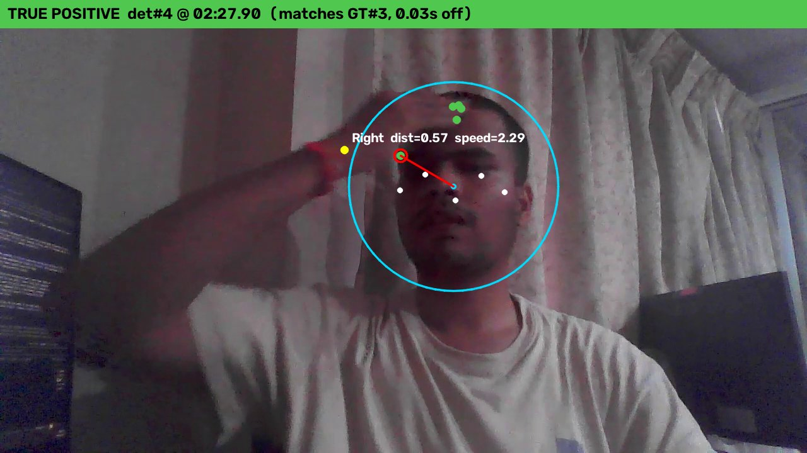
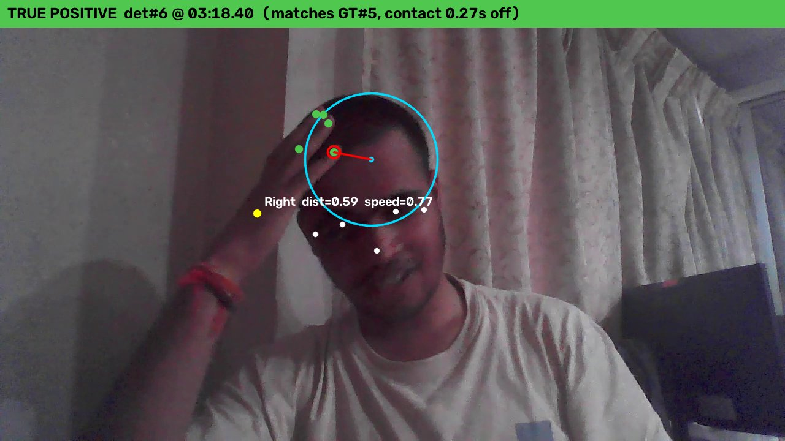
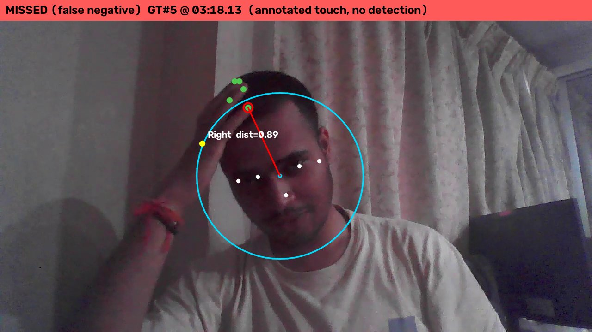
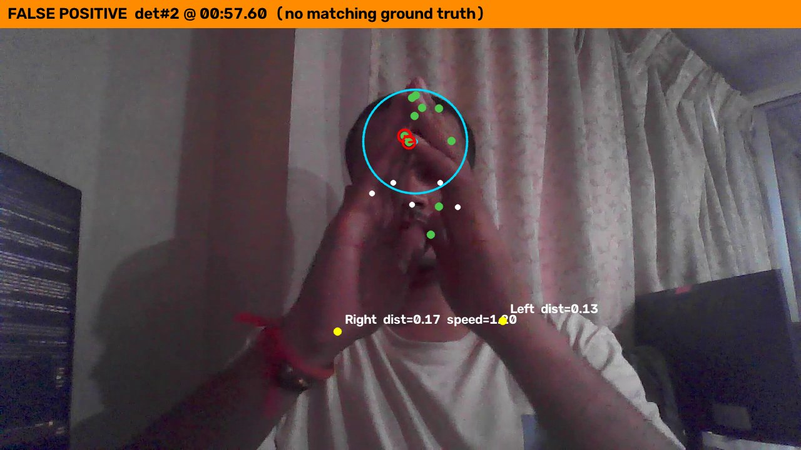
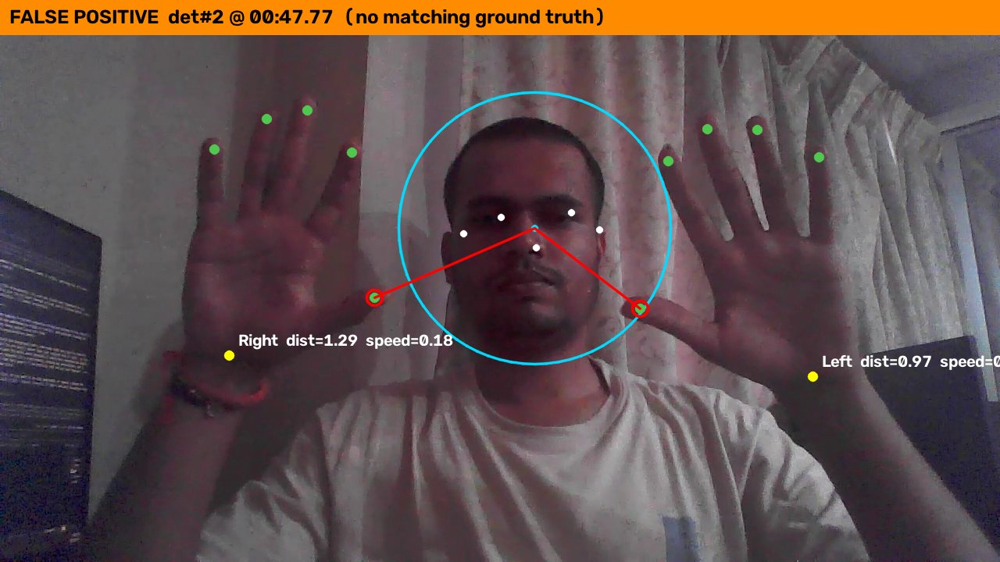

# How the head-touch detector works

The system takes a video and returns timestamps of hand-to-head touches. It is a
rule-based detector built on top of pretrained landmark models; nothing in it is trained
on this project's data. Each frame goes through four stages, and the per-frame results
are then turned into discrete events.

```
video frame ──► 1. landmarks ──► 2. head zone ──► 3. speed gate ──► 4. event state machine ──► events CSV
              (MediaPipe pose      (circle over      (wrist speed,      (debounce, start /        (start, contact,
               + hand models)       the top of the    head-widths/sec)   contact / end)             end, hand)
                                    head, normalized
                                    distance)
```

## 1. Landmarks (pretrained)

MediaPipe's **Pose Landmarker** provides the head points (nose, eyes, ears). Its
**Hand Landmarker** provides 21 points per hand plus a left/right label. Both are generic
models published by Google and used as-is, through the MediaPipe Tasks API in `VIDEO`
mode (which uses tracking between frames).

Pose landmarks are used for the head rather than Face Mesh because the moment of contact
is when the face is partly occluded by the hand, and face tracking is expected to degrade
under occlusion. **This is a reasoned choice; the two were not compared on this video.**

## 2. Geometry: the head zone

The head is modelled as a circle over the top of the head, sized from the head keypoints:

- **Head width (`head_scale`):** the ear-to-ear distance. If the ears are not both visible,
  it falls back to 2.6 x the eye-to-eye distance, then to 0.55 x the shoulder width.
- **Centre:** the average of the visible head points (nose, eyes, ears; each must have
  visibility >= 0.5, and at least two must be visible), **raised by 0.6 x `head_scale`**.
- **Radius:** **0.6 x `head_scale`**.
- **Distance:** for each detected hand, take the closest of six landmarks (the wrist and
  the five fingertips) to the zone's centre, and divide by the radius. A value of 1.0 is
  exactly the edge of the zone; below 1.0 means that landmark is inside it.
- Everything is measured in head-widths, so the value is comparable whether the person is
  near or far from the camera.

The first version used a circle centred at eye level with radius = the full head width
("original model", `--head-up 0 --head-radius 1`). It was too large and too low; see
"Pass 6" below for why it was changed and how well the evidence supports the change.

Because the zone sits over the top of the head, **contacts with the lower face (chin,
jaw, eyes) are outside it by design.** That matches the ground truth, which counts contact
with the head or forehead only.

## 3. Speed gate

A frame counts as "touching" only if the hand is inside the zone **and** not moving too
fast. A hand resting on the head is slow; a hand sweeping through is fast.

- Speed is the **wrist's** pixel speed, divided by `head_scale`, so it is in
  **head-widths per second**, smoothed over 3 frames.
- The wrist is used rather than the closest fingertip because the "closest" landmark can
  switch fingers from frame to frame and would fake motion on a hand that is still.
- If the hand was not detected for more than 0.25 s, speed is treated as unknown (not
  slow).
- Threshold: **1.5 head-widths/sec**. (0.5 was used until Pass 6; it rejected quick taps.)

## 4. Event state machine

Turns the per-frame flags into events, per hand label:

- **Start:** 3 consecutive detected frames that pass the gate. The reported start time is
  back-dated to the first of those frames.
- **End:** 10 consecutive frames that fail the gate.
- **Detection dropouts:** frames where the hand is not detected do not count toward the
  end, so a hand that is briefly hidden by the head or its own occlusion mid-touch keeps
  the touch open.
- **Contact time:** the frame with the smallest distance within 1.5 s of the start. The
  window is bounded because a hand lingering near the head can keep one event open for
  many seconds, and an unbounded minimum could pick an unrelated later dip. This frame is
  chosen by distance only, and it is the *closest* frame, not the moment of landing, so
  it lags the annotated landing (see Results).

## Worked example

Ground-truth touch #3 is annotated with contact at **02:27.93**. The detector reports
start **02:27.47** and contact **02:27.90**, with a minimum normalized distance of **0.087**
(a fingertip deep inside the zone). Timing error: **0.03 s**.



The drawing shows the head zone (cyan; its edge is distance 1.0), the head keypoints
(white), the wrist (yellow) and fingertips (green) of each hand, and the closest hand
landmark joined to the zone's centre (red).

## Live mode

`src/live_demo.py` runs the same four stages on a webcam feed, one frame at a time. Nothing
in the logic is live-specific: `analyze_frame` turns one frame's landmarks into rows, and
`TouchDetector` (one `HandTouchTracker` per hand) consumes them and reports messages as
they become known: `start` once a touch is confirmed, `end` (with the final start, contact
and end times) once it is over. The batch path, `extract_events`, is that same detector run
over a recorded signal, so the two cannot drift apart; `tests/test_touch_logic.py` checks
that they give identical events against the original whole-recording implementation.

The history the tracker keeps is only a few rows, enough to back-date a start or an end, so
memory does not grow with the stream. Live differs from offline in timing, not in logic:
an alert lags the real touch by `enter_frames` frames, the contact time is only final at
the end, and the frame-count settings span more real time when the machine processes only
10 to 17 frames per second (the models take ~60 ms per frame on the development CPU).

One live-only addition: frames where a hand is not detected do not end a touch (occlusion
by the head would otherwise split it), which on a live feed would leave a touch open after
the hand leaves the frame. `--lost-timeout` (1 s by default) closes such a touch at the
last time the hand was seen; it is off in the batch path, so batch results are unchanged.

Two short annotated clips produced by this path are in [demo/](../demo/) (a recording
streamed through the live code, not a live camera). Streaming the full recording through
`live_demo.py` at native resolution gave exactly the same 6 events as the batch run.

## Evaluation

- **`evaluate.py`** matches detected events to annotated events one-to-one by nearest
  `contact_time` within +/-0.5 s (the **strict** rule, the headline), and reports
  precision, recall, F1 and timing error. The hand label is reported but does not decide
  a match. `--match-mode overlap` additionally accepts a detection whose `[start, end]`
  interval overlaps the annotated one. The overlap rule was added after seeing that the
  strict rule scores a detected forehead touch as a miss because of the contact-time lag,
  so it is a secondary, more lenient number.
- **`tune_threshold.py`** grid-searches the gate and state-machine settings for a given
  head shape; **`geometry_experiment.py`** compares head shapes (Pass 6).

## Results

Ground truth is 5 annotated touches: the original 3, plus a 4th (forehead, found during a
false-positive review) and a 5th (a quick tap at 03:18) that were added after the
detector's output had been seen.

| 5 annotated touches | Pass 5, strict | Pass 5, overlap | **Pass 6, strict** | **Pass 6, overlap** |
|---|---|---|---|---|
| Head model | original circle | original circle | raised, smaller zone | raised, smaller zone |
| Speed limit | 0.5 | 0.5 | 1.5 | 1.5 |
| Detected events | 11 | 11 | 6 | 6 |
| True positives | 3 | 4 | 3 | 5 |
| False negatives | 2 | 1 | 2 | 0 |
| False positives | 8 | 7 | 3 | 1 |
| Precision | 0.27 | 0.36 | 0.50 | 0.83 |
| Recall | 0.60 | 0.80 | 0.60 | 1.00 |
| F1 | 0.37 | 0.50 | 0.55 | 0.91 |
| Mean timing error | 0.26 s | 0.42 s | 0.17 s | 0.47 s |

Under the strict rule Pass 6 still misses touches 2 and 4, but they are *detected*: the
detected contact time (the closest frame) is 0.76 s and 1.07 s after the annotated
landing, outside the +/-0.5 s tolerance. Only the overlap rule counts them.

## Pass 6: does a better head shape help?

**Hypothesis.** The original head circle (centred at eye level, radius = full head width)
was too large and too low: open hands raised beside the face fell inside it, so it could
not tell them from a hand on top of the head. A smaller, higher zone might separate them,
which would also let the speed gate be loosened enough to catch a quick tap.

**Protocol, fixed before running** (though the hypothesis itself came from looking at this
video's frames, so it is not independent of the data it was tested on). Head-centre raise in {0, .2, .4, .6}, radius in
{.5, .6, .7, .8, .9, 1.0}, speed limit in {0.5, 1.0, 1.5, none}; other settings unchanged;
selection by F1 under the overlap rule. The raw geometry was cached once so every
variant could be scored without re-running the landmark models (the original head model
reproduces the earlier distances to within 0.0002). Full output:
[results/geometry_experiment.txt](../results/geometry_experiment.txt).

**Result, in-sample (all 5 touches).** The best setting was raise 0.6, radius 0.6, speed
limit 1.5: all 5 touches found, 1 extra detection (down from 7). The quick tap at 03:18,
missed by every earlier setting, is now detected, and the raised-hand detections are gone.

- **The direction is robust, not a single spike.** With the speed limit at 0.5, raise 0.6
  with radius 0.6-0.9, and raise 0.4 with radius 0.8-0.9, keep 4 touches with at most 1
  extra detection, against 7 for the original model. Extra detections fall as the zone
  moves up and shrinks, but too small a zone loses real touches (raise 0.6 with radius 0.5
  keeps only 3).
- **The winner sits on the edge of the tested grid** (0.6 is the largest raise tried), so
  a better setting may lie beyond it; that was not explored, to keep the protocol fixed.

**Result, leave-one-out (the honest estimate).** Choosing settings on 4 touches and
testing on the held-out one found only **3 of 5** held-out touches, versus 4 of 5 for the
old fixed defaults. Two folds failed for different reasons:
- Holding out touch 1 picked radius 0.5, a zone so small that it loses touch 1.
- Holding out touch 5 picked the *tight* speed limit, because none of the other four
  touches is a quick tap, so nothing in the training data argues for loosening it.

So the evidence supports the *geometry direction* (a smaller, higher zone removes most
false positives), but the *specific values* were fitted to these 5 touches in one video,
and catching the quick tap depends on touch 5 itself. Treat 0.83 precision as an in-sample
number.



For comparison, this is the same touch under the original head model, where it was missed:



## What still goes wrong

The one remaining extra detection (00:57.60) is both hands clasped in front of the face.
The fingertips overlap the head zone in the image, but the hands are in front of the head,
not on it. The detector is 2D, so it cannot tell the difference.



Before Pass 6, 8 extra detections were reviewed by eye (frames in
[results/frames_pass5/](../results/frames_pass5/)): five were open hands raised beside the
face, one was the real forehead touch that had been missed in the annotation, and two were
contacts with the chin and the eye, which the ground truth does not count.



## Files

| File | Role |
|---|---|
| `src/inspect_video.py`, `src/annotate.py` | Video metadata; interactive ground-truth annotation tool |
| `src/head_touch_detector.py` | The core: landmarks, head zone, speed, event extraction |
| `src/evaluate.py`, `src/tune_threshold.py`, `src/geometry_experiment.py` | Scoring, gate tuning, head-shape comparison |
| `src/visualize_events.py` | Draws the detector's view on each detected contact frame |
| `src/live_demo.py` | Live webcam / stream mode with overlay, alerts and optional recording |
| `src/reencode_h264.py` | Dev helper: re-encode a `--record` video to browser-playable H.264 |
| `tests/test_touch_logic.py` | Event-logic tests, incl. streaming vs. the original batch implementation |
| `src/timeutils.py`, `src/download_models.py` | Shared time helpers; model download |

## Design rationale and caveats

- **Pose over Face Mesh** is a hypothesis about occlusion robustness, not a measured
  result.
- **Everything is in-sample.** The head shape and speed limit in use were chosen against
  all 5 touches from one person, one camera and one recording; the older gate settings
  were tuned on the original 3. Leave-one-out found 3 of 5 held-out touches. Validation on
  other people, cameras and lighting is the real next step.
- **The ground truth changed after the detector ran.** The 4th touch was found through the
  false-positive review and the 5th was noticed later. These correct annotation errors,
  but the ground truth is not fully independent of the detector's output. The overlap
  rule was likewise added after seeing results.
- **Contact time lags the landing.** It is the closest frame, while annotations mark where
  the hand lands: +0.20, +0.76, +0.03, +1.07 and +0.27 s on the five touches (Pass 6).
- **Hand identity is only the MediaPipe left/right label.** In 58 (frame, hand) pairs both
  hands get the same label, which merges two hands in the speed and event logic.
- **The zone only covers the top of the head**, so face contacts below the eyes are not
  detected, which is consistent with the ground truth but would need revisiting if the
  target changes.
- **Live accuracy is unmeasured.** Live mode was checked on a recording streamed through
  the live loop (identical events to the batch run) and informally on a laptop webcam, but
  no accuracy was measured on a live feed.
- **Rule-based, not trained.** The natural next step is a small classifier over the
  existing features (distance, speed, dwell time), but only once footage from several
  people and cameras is available.
